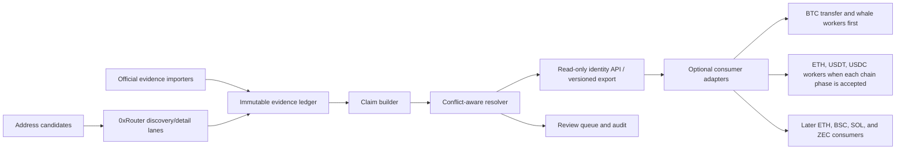

# Multi-Chain Address Identity System Design

## Status

Proposed design. This document defines a multi-chain address-identity
architecture with a deliberately serial delivery sequence: BTC first, then
Ethereum, BNB Smart Chain, Solana, and Zcash. Only the BTC phase is authorized
to proceed toward an initial production-ready consumer integration. It does not
authorize a production sync, label promotion, alert suppression, or a mutation
of any consumer project.

## Decision

Build `crypto_address_identity` as the canonical evidence and resolution layer
before integrating it into BTC transfer or whale workers.

`0xRouter` / Arkham is a first-class **external seed-evidence source**. It is
not the system of record for ownership, wallet role, or alert suppression. A
provider response creates a durable candidate claim; a separate resolution
policy decides whether that claim is only discoverable, lookup-usable,
confirmed, contested, or eligible for a narrowly defined operational action.

This separates three questions that must not be conflated:

1. What did a source say about an address at a point in time?
2. What evidence supports or conflicts with that statement?
3. What may a consuming worker safely do with the resolved result?

## 0xRouter / Arkham Research Findings

The following is based on read-only, token-authenticated probes on 2026-07-22.
The request rate was one request per 4.05 seconds, below the configured 30
requests/minute ceiling. No credential, raw response, or signing payload is
stored in this repository.

### Supported Chains

`/chaindata/chains` returned 15 chains, including `bitcoin`, `ethereum`,
`bsc`, `solana`, and `zcash`. The provider uses `bsc` for BNB Smart Chain.

### Enriched Address Contract

For a populated chain result, `address_enriched/{address}/all` returned a
chain-keyed object. The common per-chain fields were:

| Field | Observed shape | Identity use |
| --- | --- | --- |
| `address` | string | Source-address echo; verify after canonicalization. |
| `chain` | string | Provider chain key; map through the local chain registry. |
| `isUserAddress` | boolean | Address-kind hint only; not ownership evidence. |
| `arkhamEntity` | object | Candidate entity with stable provider `id`, `name`, `type`, and optional public metadata. |
| `arkhamLabel` | object | Candidate address label with `name`, `address`, and `chainType`. |
| `populatedTags` | list | Candidate tags with `id`, `label`, `chain`, `rank`, `tagParams`, `disablePage`, and `excludeEntities`. |
| `contract` | boolean, EVM only in the probe | Address-kind hint: contract versus externally owned address. |
| `program` | boolean, Solana probe | Address-kind hint: program versus ordinary account. |

`clusterIds` was not present in these probes even when requested. It remains an
optional raw-provider extension, never a required schema field or an automatic
entity merge signal.

### Chain-Specific Observations

| Chain family | Probe result | Design consequence |
| --- | --- | --- |
| Bitcoin | One `bitcoin` root with entity, label, and tags. | Native address identity is chain-scoped. No automatic clustering from provider tags. |
| EVM | One 20-byte address expanded to roots for Ethereum, BSC, Polygon, Base, Arbitrum, Optimism, Avalanche, Flare, HyperEVM, and Hypercore. | Store every `(chain, normalized_address)` separately. Equal bytes across EVM chains are a relationship, not proof of common ownership. |
| BNB Smart Chain | Provider root is `bsc`. | Map to canonical `bsc` / chain ID `56`; never use an ambiguous `bnb` identifier. |
| Solana | A `solana` root included `program` plus entity, label, and tags. | Keep program, mint, token-account, and wallet classifications separate from entity ownership. |
| Zcash | A transparent-address probe returned only `address`, `chain`, and `isUserAddress`; no label, entity, or tag fields. | Treat Zcash provider label coverage as unknown. An empty response is not evidence of unknown ownership. Address identity applies only to transparent addresses; shielded recipients are out of scope. |

### Cost and Sync Implications

For the EVM probe, a detailed `/all` request with tags was approximately 114 KB,
while `/all?includeTags=false&includeEntityPredictions=true&includeClusters=false`
was approximately 4.8 KB and still returned per-chain entity and label fields.

Therefore the ingestion path must have two lanes:

1. **Discovery lane:** low-cost all-chain entity/label fan-out without tags or
   clusters. It is the default for EVM addresses.
2. **Detail lane:** tag collection only for new, changed, high-value, or
   explicitly reviewed addresses. It is budgeted and never runs for every
   address on every cadence.

The configured tenant limit is 30 requests/minute. The implementation should
enforce a shared token-bucket limit of at most 20 requests/minute by default,
with no concurrent bypass. It should also meter response bytes because gateway
cost is response-size sensitive.

### What the Provider Fields Do Not Mean

- `rank` is a provider ordering field, not a confidence score.
- `disablePage` and `excludeEntities` are UI/product metadata, not evidence.
- An entity name match is not proof of wallet control or ownership transfer.
- A free-text `hot`, `cold`, `deposit`, or `withdraw` tag is not a normalized
  `wallet_role` claim.
- A missing entity, label, or tag is not an `unknown` ownership conclusion.

## Scope

### Target Architecture

- BTC mainnet transparent addresses.
- Ethereum mainnet (`1`) addresses.
- BNB Smart Chain (`56`) addresses.
- Solana mainnet addresses, with account-kind classification.
- Zcash transparent `t1` / `t3` addresses only.
- Arkham/0xRouter observations as dynamic seed evidence.
- Official signed proof-of-reserves, official wallet lists, regulator records,
  and reviewed public evidence as corroborating evidence.
- A read-only resolver and a narrow consumer adapter contract.

The schema, chain registry, evidence policy, and resolver must support every
listed chain from the outset. That is an architectural compatibility target,
not permission to query, sync, or promote all five chains in parallel.

### Initial Delivery Scope: BTC Only

The first implementation and operational closure cover Bitcoin only:

- BTC address normalization and chain-registry validation.
- BTC 0xRouter/Arkham seed-evidence ingestion, subject to the shared quota and
  response-byte budgets.
- BTC official-evidence import, conflict review, and read-only resolver output.
- BTC transfer and whale replay followed by a separately approved consumer
  integration.

No Ethereum, BSC, Solana, or Zcash address is fetched, refreshed, or made
available to a consumer during the BTC phase except for a deliberately bounded
schema-contract test that does not persist provider data.

### V1 Out of Scope

- Automatic entity clustering or inferred common ownership.
- Shielded Zcash address attribution.
- Automatic wallet-role promotion from provider text.
- Alert suppression, alert delay, monitor enrollment, or ownership-transfer
  inference based on identity data alone.
- A full historical dump of Arkham labels; the observed API is address-centric.

## Architecture



The system is evidence-first and append-only. Source observations and evidence
are immutable. Claim and resolution revisions are versioned; a later decision
supersedes an earlier one without overwriting its history.

## Canonical Data Model

### Chain Registry

`chain_registry` maps provider names to local, stable chain identities.

| `chain_key` | Family | Canonical identifier | Address normalization |
| --- | --- | --- | --- |
| `bitcoin` | UTXO | `bitcoin:mainnet` | Preserve valid Base58/Bech32 spelling after checksum validation. |
| `ethereum` | EVM | `eip155:1` | Lowercase storage plus display checksum. |
| `bsc` | EVM | `eip155:56` | Lowercase storage plus display checksum. |
| `solana` | Solana | `solana:mainnet` | Base58, exact byte identity. |
| `zcash` | UTXO privacy | `zcash:mainnet` | Transparent `t1`/`t3` only. |

The canonical subject key is:

```text
address_id = sha256(chain_key + ":" + normalized_address)
```

An EVM shared-address relation is stored separately as an explicit
`same_address_bytes_across_chain` relationship. It never creates an entity
merge by itself.

### Immutable `source_observation`

One record per provider request or imported primary source artifact:

```text
observation_id, source_id, source_version, endpoint_template, query_profile,
requested_at, completed_at, http_status, response_bytes, payload_sha256,
schema_fingerprint, rate_limit_profile, retention_class
```

Raw source payloads live outside Git under restricted runtime storage. The
normalized evidence ledger includes a payload hash and source reference, never
a credential or request header.

### Immutable `identity_evidence`

Each source statement becomes an independent evidence row:

```text
evidence_id, observation_id, address_id, assertion_type, candidate_entity_id,
candidate_entity_name, candidate_label, candidate_wallet_role,
provider_entity_id, provider_tag_id, source_authority,
evidence_tier, verification_method, source_url, artifact_sha256,
asserted_at, observed_at, effective_from, effective_to, expires_at,
license_ref, independence_group, evidence_status
```

`assertion_type` is one of `entity_control`, `address_label`, `wallet_role`,
`address_kind`, `contract_identity`, or `relationship`. Entity control and
wallet role are deliberately independent assertions.

### Versioned `identity_claim`

A claim groups compatible evidence without erasing disagreements:

```text
claim_id, address_id, assertion_type, asserted_value, entity_id,
claim_status, confidence_score, evidence_strength, corroboration_count,
independence_count, effective_from, effective_to, reviewed_at, reviewer_ref,
supersedes_claim_id
```

Claim statuses are `unreviewed_external`, `accepted`, `contested`, `rejected`,
`deprecated`, and `expired`.

### Read-Only `identity_resolution`

This is the only object consumers should read:

```text
resolution_id, address_id, assertion_type, state, primary_claim_id,
candidate_claim_ids, operational_tier, conflict_set_id, resolved_at,
resolution_version, freshness_status
```

Resolver states: `resolved`, `ambiguous`, `unattributed`, `stale`, and
`unsupported`.

## Evidence Strength and Corroboration

The requested high-strength fields belong on evidence and claims, not in a
single mutable `confidence` column.

| Tier | Evidence example | Default effect |
| --- | --- | --- |
| `A` | Cryptographic address-control proof, signed PoR, signed-message proof | Can establish an entity-control claim for its stated scope. |
| `B` | Official address list, regulator designation, official reserve disclosure without direct signature | Can establish a reviewed entity-control claim. |
| `C` | Arkham/0xRouter entity, label, or tag response | Creates `unreviewed_external` candidate evidence. |
| `D` | Reputable explorer or public research label | Corroborating candidate only. |
| `E` | Local on-chain heuristic or behavioral inference | Analytical context only. |

Every evidence row must also carry:

- `source_authority`: official, regulator, commercial provider, public
  explorer, or local inference;
- `verification_method`: signature, published-list, API observation, manual
  review, or heuristic;
- `independence_group`: prevents two views of the same source from counting as
  independent corroboration;
- `effective_from` / `effective_to` / `expires_at`: identities and roles can
  change over time;
- `source_url` and `artifact_sha256`: reproducibility without storing secrets;
- `evidence_status`: valid, stale, revoked, disputed, or superseded; and
- `conflict_set_id`: links incompatible claims without forcing a winner.

### Resolution Policy

| Evidence situation | Resolution | Operational tier |
| --- | --- | --- |
| Arkham only | `unreviewed_external` claim | `discovery_only` |
| Arkham plus one Tier A/B proof for same entity/address | `accepted` entity claim | `lookup_usable` |
| Conflicting accepted or unreviewed claims | `ambiguous` / `contested` | `lookup_only` |
| Tier A/B same-entity proof plus independently corroborated current role | `resolved` | `monitor_eligible` after consumer-specific review |
| Same-entity proof plus chain-derived self-churn and current strong policy | `resolved` | potentially `suppression_eligible`, never automatic from identity alone |

The existing contested BTC labels remain examples of `ambiguous`: retain all
claims, expose the conflict, and deny monitor or suppression promotion.

## Dynamic Seed and Refresh Plan

The provider is address-centric. V1 therefore does not claim to retrieve a
complete global Arkham label universe. Instead it expands from a transparent,
prioritized candidate queue:

1. Existing known monitor/lookup addresses and official evidence imports.
2. Addresses in large-transfer, whale, treasury, exchange-flow, and
   counterparty events.
3. Counterparties of high-priority addresses, bounded by per-run fan-out.
4. Addresses specifically requested for review.

For each address, run discovery first. Send the detail query only when one of
these is true:

- no prior provider observation exists;
- the minimal response hash changed;
- the address crossed a value/risk threshold;
- it has unresolved or contested evidence; or
- a human requested review.

The scheduler uses a shared 20/minute token bucket, a response-byte budget, and
per-address freshness TTLs. HTTP 429, transport failures, malformed payloads,
and unsupported-chain results are recorded as observation outcomes, never
converted into an empty or negative identity claim.

## Multi-Chain Safeguards

- **Bitcoin:** tags can enrich an address but do not establish UTXO ownership
  beyond the source assertion.
- **Ethereum / BSC:** chain ID is mandatory in every subject and claim key.
  The same 20-byte address on two chains is never automatically the same wallet
  or entity.
- **Solana:** program/mint/token-account labels must not be surfaced as wallet
  roles. Token mint identities use `contract_identity`, not `entity_control`.
- **Zcash:** only transparent addresses are accepted. Shielded pool activity
  may create a non-identifying behavioral observation, never an address claim.

## Consumer Contract

Consumers do not read provider payloads or decide source precedence. They call
or materialize a narrow resolver view:

```text
resolve(chain_key, address) ->
  state, entity_candidates, accepted_entity, wallet_role_candidates,
  operational_tier, conflict_set_id, evidence_summary, freshness_status
```

The resolver is one-way and read-only from the consumer's perspective. An
identity outage, stale result, unsupported chain, or ambiguous result must not
block the collector's raw-event ingest, cursor advancement, lake publishing, or
existing alert decision. The consumer records the lookup outcome as an
attribution caveat and continues with its own business contract.

### `quant_crypto` Consumer Boundaries

`quant_crypto` is a set of independent consumers, not a control plane for this
project. Each worker receives only a versioned resolver response or export; it
never receives provider credentials, raw provider payloads, identity write
access, review-queue control, or a shared mutable cursor.

| Consumer | Intended use of identity result | Explicit non-effect in initial integration |
| --- | --- | --- |
| `btc_transfer_worker` | Enrich watched-address and counterparty entity/role fields; preserve conflicting labels as caveats. | Does not change UTXO net-flow calculation, threshold, cursor, provider calls, or alert threshold. |
| `btc_whale_worker` and alert dispatcher | Add entity, role, evidence tier, and ambiguity context to output-level whale alerts. | Does not suppress, delay, deduplicate, or reclassify a whale alert solely from identity data. |
| Future ETH transfer worker | Resolve `eip155:1` sender/receiver identities and contract context. | Does not change transfer parsing, finality policy, quality gates, or publishing. |
| `usdt_transfer_worker` | Resolve endpoint identities on each already-supported network; distinguish token/contract identity from wallet ownership. | Does not alter USDT native-versus-bridged asset semantics, provider selection, thresholds, or alert policy. |
| `usdc_transfer_worker` | Resolve Circle treasury, exchange, and CCTP context after native-USDC validation. | Does not alter Circle-native contract validation, CCTP handling, thresholds, or alert policy. |

USDT and USDC are consumer products spanning more than one chain. Their
adapters must resolve each endpoint using the event's existing `chain_key`; a
token symbol never selects an address identity. Consequently, a BTC-first
implementation can integrate only the BTC consumers. ETH, BSC, Solana, and
Zcash consumer adapters remain disabled until their respective identity phases
have completed.

The BTC adapter is the first consumer, not a special case. It should:

1. replace direct provider or YAML lookups with the resolver view;
2. retain current local labels as evidence imports rather than overwrite them;
3. treat `ambiguous` as a caveat, not a suppression signal; and
4. preserve the existing chain-derived suppression gates.

Every consumer-side enrichment row should retain
`identity_resolution_version`, `identity_resolved_at`, `identity_state`, and
`identity_lookup_status`. This makes an attribution decision reproducible
without mutating historical raw transfer or alert rows.

## Delivery Sequence

### Phase 1: BTC Closed Loop

1. Implement the generic chain registry, address normalization, immutable
   observation and evidence schemas, and a local SQLite/DuckDB-backed resolver,
   with BTC as the only enabled chain.
2. Implement BTC-only 0xRouter discovery and detail ingestion with the
   20/minute shared limiter, byte budget, payload hashing, and no-secret
   logging.
3. Import the already audited BTC official PoR and contested-claim evidence.
4. Implement the review queue, claim resolution, and conflict-set model using
   BTC samples.
5. Add the BTC read-only adapter and replay it against existing whale/transfer
   samples. Do not change notification behavior in this step.
6. Review BTC coverage, conflicts, latency, cost, and consumer usefulness;
   close the BTC producer-to-consumer acceptance loop before enabling another
   chain.

During this phase, the only allowed `quant_crypto` integrations are
`btc_transfer_worker`, `btc_whale_worker`, and the downstream BTC whale alert
dispatcher. They are read-only enrichments and remain independently deployable
and rollbackable.

### Phase 2: Ethereum

Enable Ethereum only after Phase 1 acceptance. Run an Ethereum-specific schema
and source-capability check, then repeat the seed-evidence, official-evidence,
review, replay, and consumer-acceptance sequence.

### Phase 3: BNB Smart Chain

Enable BSC only after the Ethereum phase closes. BSC retains its own
`eip155:56` subject space and evidence lifecycle even when its address bytes
match an Ethereum subject.

### Phase 4: Solana

Enable Solana only after the BSC phase closes. Validate program, mint,
token-account, and wallet distinctions before accepting any role claim.

### Phase 5: Zcash

Enable Zcash only after the Solana phase closes. Limit the first phase to
transparent addresses and require a separate coverage assessment before any
consumer use.

Only after the relevant chain has completed its acceptance loop may narrowly
scoped monitor or suppression promotions be considered under the evidence
policy above.

## Acceptance Criteria for the MVP

- A provider observation can be reproduced by payload hash and schema
  fingerprint without exposing a token.
- The same EVM address on Ethereum and BSC resolves as two chain-scoped
  subjects.
- An Arkham-only label is visible but not accepted as ownership truth.
- A signed-PoR import can corroborate an Arkham candidate without overwriting
  a conflicting claim.
- Conflicts resolve to `ambiguous` and remain auditable.
- Zcash transparent support is explicit; an empty provider response does not
  create an `unknown owner` claim.
- BTC consumer replay produces no change to existing alert suppression until a
  separate policy approval is made.
- An unavailable or ambiguous identity resolution does not prevent a
  `quant_crypto` consumer from ingesting, publishing, or alerting under its
  existing contract.
- BTC, ETH, USDT, and USDC adapters cannot write identity evidence or alter one
  another's worker state, thresholds, cursors, or alert decisions.
